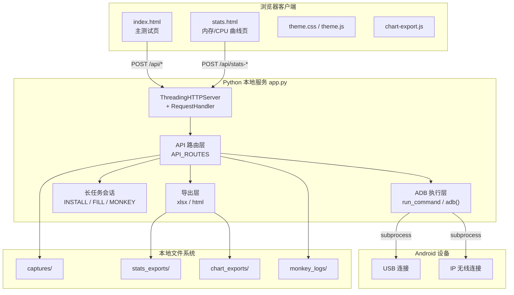
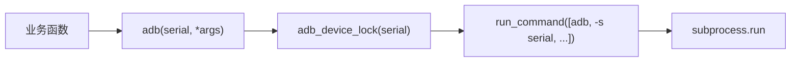
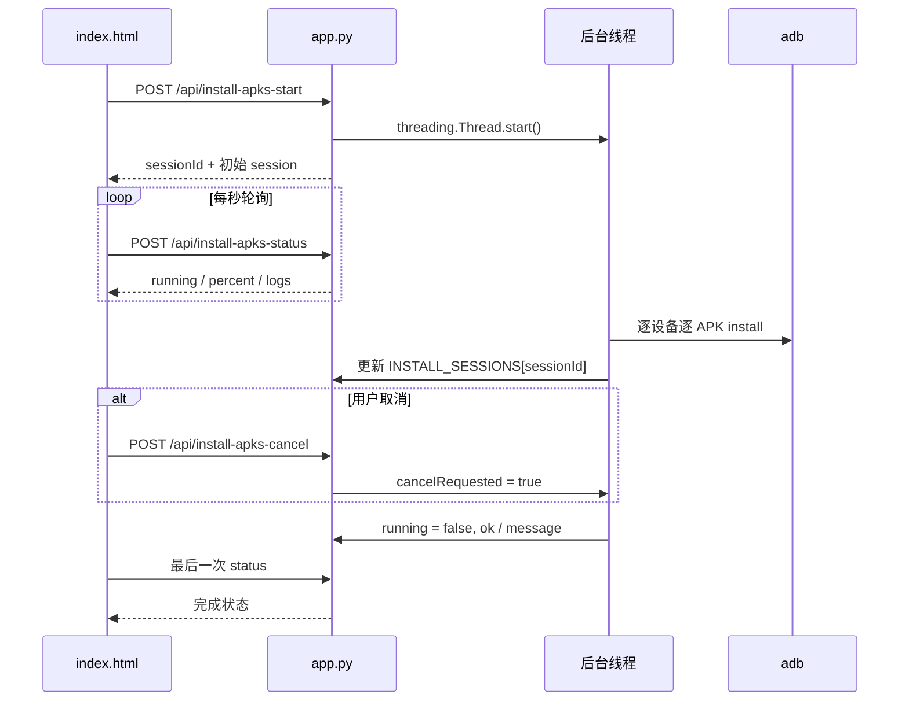
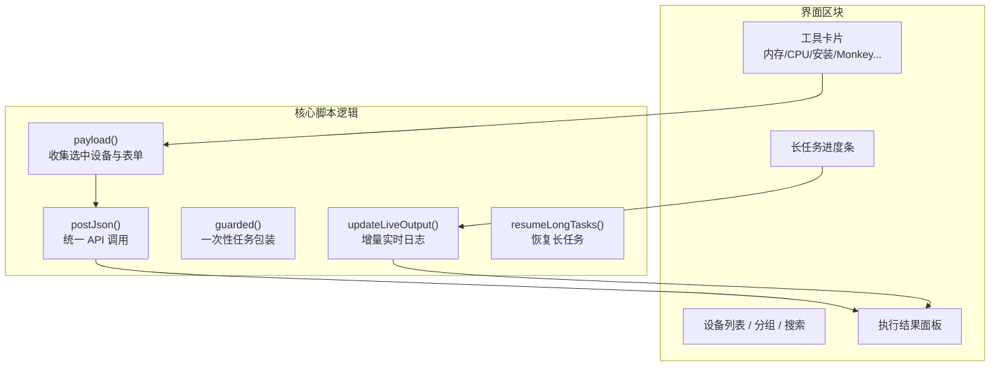
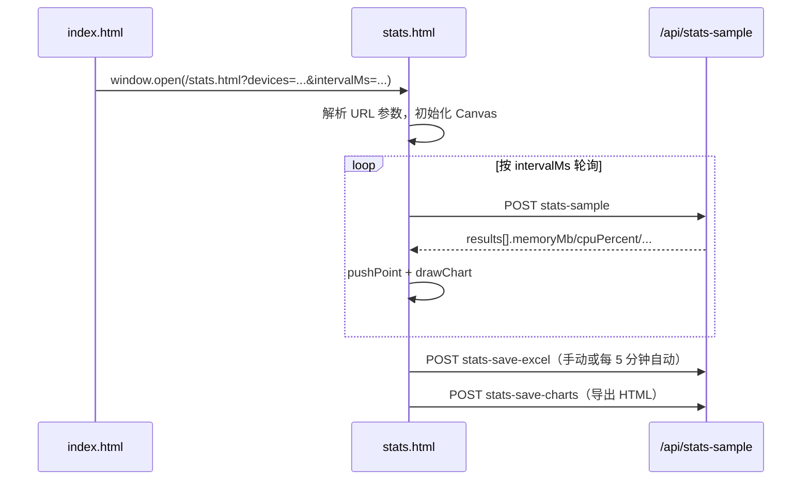

# Android 智能设备测试工具 — 技术架构与原理

本文档说明本工程的整体技术架构、运行原理、模块划分与关键设计决策，便于开发、维护与二次扩展。

---

## 1. 项目定位

这是一个**本地运行的 Android 设备测试工具**，通过浏览器提供操作界面，后端通过 `adb` 与 Android 设备通信，完成设备管理、性能采样、批量安装、Monkey 压测、截图录屏等测试任务。

核心设计原则：

- **零运行时 Python 依赖**：后端仅使用 Python 标准库，降低测试环境部署成本。
- **浏览器即 UI**：不引入前端框架，使用原生 HTML/CSS/JavaScript。
- **ADB 即设备通道**：所有设备操作统一通过 `adb` 子进程完成。
- **本地单机优先**：默认监听 `127.0.0.1`，面向测试工程师本机使用。
- **可打包为 EXE**：通过 PyInstaller 生成单文件可执行程序，便于分发。

---

## 2. 总体架构



### 2.1 请求处理链路

1. 用户在前端点击按钮或触发轮询。
2. 浏览器通过 `fetch()` 向本地 HTTP 服务发送 JSON 请求。
3. `RequestHandler.do_POST()` 解析 JSON，分发到 `API_ROUTES` 中对应处理函数。
4. 处理函数调用 `adb()` 或后台线程执行设备操作。
5. 结果以统一 JSON 格式返回前端，由结果区或进度条展示。

### 2.2 双页面分工

| 页面 | 职责 |
|------|------|
| `index.html` | 设备管理、一次性查询、长任务（填充/安装/Monkey）、截图录屏 |
| `stats.html` | 内存/CPU 连续采样、Canvas 曲线绘制、Excel/HTML 导出 |

两页共享 `theme.css` / `theme.js`，曲线导出逻辑由 `chart-export.js` 提供。

---

## 3. 技术栈

| 层级 | 技术 | 说明 |
|------|------|------|
| 后端语言 | Python 3.10+ | 单文件 `app.py` |
| HTTP 服务 | `http.server.ThreadingHTTPServer` | 多线程处理并发请求 |
| 设备通信 | Android `adb` | 通过 `subprocess` 调用 |
| 前端 | 原生 HTML/CSS/JS | 无 React/Vue 等框架 |
| 图表 | HTML5 Canvas | `stats.html` 内自绘 |
| Excel 导出 | 手写 OOXML ZIP | 无 openpyxl/pandas 依赖 |
| 打包 | PyInstaller | `build_exe.bat` 一键构建 |

---

## 4. 目录与模块

```text
Android_tool/
├── app.py                 # 后端核心：HTTP 服务、API、ADB、会话、导出
├── index.html             # 主页面 UI 与业务脚本
├── stats.html             # 曲线采样页 UI 与 Canvas 绘制
├── theme.css              # 全局主题变量与样式
├── theme.js               # 明暗主题切换（localStorage 持久化）
├── chart-export.js        # 交互式曲线 HTML 导出
├── build_exe.bat          # Windows 打包脚本
├── README.md              # 使用说明
├── ARCHITECTURE.md        # 本文档
├── captures/              # 截图、录屏输出（运行时创建）
├── stats_exports/         # Excel 采样数据
├── chart_exports/         # 曲线 HTML 导出
└── monkey_logs/           # Monkey 日志与白名单文件
```

### 4.1 运行目录策略

| 运行方式 | 静态资源目录 `RESOURCE_DIR` | 输出目录 `APP_DIR` |
|----------|----------------------------|-------------------|
| 源码 `python app.py` | 项目根目录 | 项目根目录 |
| PyInstaller EXE | `_MEIPASS`（临时解压目录） | EXE 所在目录 |

这意味着：打包后页面资源从 EXE 内读取，但截图、Excel、日志等文件写入 EXE 同目录，便于用户查找。

---

## 5. 后端架构（`app.py`）

### 5.1 启动流程

```text
main()
  ├─ 解析 ADB_EXECUTABLE（PATH > ANDROID_ADB > android_tool.json）
  ├─ 创建默认输出目录
  ├─ 启动 ThreadingHTTPServer(127.0.0.1:8000)
  ├─ 1 秒后自动打开浏览器
  └─ serve_forever()
```

环境变量：

- `ANDROID_TOOL_HOST`：监听地址，默认 `127.0.0.1`
- `ANDROID_TOOL_PORT`：端口，默认 `8000`
- `ANDROID_ADB`：备用 adb 路径

### 5.2 HTTP 处理器

`RequestHandler` 继承 `SimpleHTTPRequestHandler`，主要能力：

- **GET `/`**：返回 `index.html`
- **GET `/api/devices`**：设备列表
- **GET `/api/adb-status`**：ADB 版本与可用设备数
- **GET 静态资源**：`stats.html`、`theme.css` 等
- **POST `/api/*`**：所有业务 API，统一 JSON 入参/出参

错误处理约定：

- 参数错误 → `400` + `{"ok": false, "error": "..."}`
- 未知 API → `404`
- 服务端异常 → `500`

### 5.3 ADB 执行层



关键函数：

| 函数 | 作用 |
|------|------|
| `resolve_adb_executable()` | 启动时解析 adb 路径 |
| `run_command()` | 通用子进程执行，统一超时与编码处理 |
| `adb()` | 带设备锁的 adb 调用 |
| `adb_install()` | 安装专用：兼容厂商 adb 的 transport 选择 |
| `for_each_device()` | 多设备批量执行模板 |

#### ADB 路径解析优先级

1. 系统 `PATH` 中第一个 `adb`（与 Windows `where adb` 顺序一致）
2. 环境变量 `ANDROID_ADB`
3. 配置文件 `android_tool.json` 中的 `adbPath`

#### 并发控制

- `_GLOBAL_ADB_LOCK`：无 serial 的全局 adb 命令（如 `devices`、`connect`）
- `_SERIAL_ADB_LOCKS`：按设备 serial 分锁，避免同一设备并发 adb 竞态

#### 厂商 adb 兼容（批量安装）

部分定制 adb（如 PUDU）在使用 `adb -s <serial> install` 时会触发 Push Install 失败（`unknown host service`）。安装逻辑会按以下顺序选择目标：

1. `adb -t <transport_id> install ...`（从 `adb devices -l` 解析）
2. 仅一台设备时：`adb install ...`（不指定 serial）
3. 回退：`adb -s <serial> install ...`

### 5.4 多设备执行模式

绝大多数 API 使用 `for_each_device(data, worker)`：

```python
# 请求体包含 devices: ["serial1", "serial2"]
# 响应体统一为：
{
  "ok": true,
  "results": [
    {"device": "serial1", "ok": true, "stdout": "...", "stderr": ""},
    {"device": "serial2", "ok": false, "stdout": "", "stderr": "..."}
  ]
}
```

前端按 `results` 数组逐台展示执行结果。

---

## 6. API 设计

### 6.1 设备管理

| API | 方法 | 功能 |
|-----|------|------|
| `/api/devices` | GET/POST | 列出 `adb devices -l` |
| `/api/connect-ip` | POST | `adb connect <ip:5555>` |
| `/api/adb-status` | GET | ADB 版本、路径、可用设备数 |

### 6.2 一次性性能查询

| API | ADB 命令模式 |
|-----|-------------|
| `/api/process-memory` | `dumpsys meminfo` + 进程名过滤 |
| `/api/app-memory` | `dumpsys meminfo <package>` |
| `/api/app-cpu` | `pidof` + `top` 或回退 `dumpsys cpuinfo` |
| `/api/total-cpu` | `top` 解析 idle/usage |
| `/api/app-total-cpu` | 同时采样 APP CPU 与总 CPU |

内存解析：`parse_memory_mb()` 从 `dumpsys meminfo` 提取 KB 并转 MB。  
CPU 解析：`parse_top_cpu_percent()` / `parse_total_cpu_percent()` 适配不同 `top` 输出格式。

### 6.3 连续采样（曲线页）

| API | 功能 |
|-----|------|
| `/api/stats-sample` | 按配置对每台设备采样 memory/cpu/totalCpu |
| `/api/stats-save-excel` | 将前端累积的 rows 写入 `.xlsx` |
| `/api/stats-save-charts` | 保存交互式曲线 HTML |

采样由 `stats.html` 定时轮询 `/api/stats-sample` 完成，后端不保存历史采样，数据保存在浏览器内存中。

### 6.4 长任务会话 API

三类长任务均采用 **Start → Status 轮询 → Cancel** 模式：

| 任务 | Start | Status | Cancel |
|------|-------|--------|--------|
| 内存填充 | `/api/fill-memory-start` | `/api/fill-memory-status` | `/api/fill-memory-cancel` |
| 批量安装 APK | `/api/install-apks-start` | `/api/install-apks-status` | `/api/install-apks-cancel` |
| Monkey 测试 | `/api/monkey-start` | `/api/monkey-status` | `/api/monkey-cancel` |

另有同步版 `/api/fill-memory`、`/api/install-apks` 供简单调用，主页面使用会话版以支持进度与取消。

### 6.5 媒体与系统信息

| API | 原理 |
|-----|------|
| `/api/screen-size` | `adb shell wm size` |
| `/api/screenshot` | `adb exec-out screencap -p` 保存 PNG |
| `/api/record-start` | `adb shell screenrecord` 后台进程 |
| `/api/record-stop` | 终止录屏 → `adb pull` → 删除设备端文件 |
| `/api/current-package` | 解析 `dumpsys window` / `dumpsys activity top` |

---

## 7. 长任务会话模型



### 7.1 会话存储结构

内存中的全局字典（进程重启后丢失）：

- `FILL_SESSIONS`
- `INSTALL_SESSIONS`
- `MONKEY_SESSIONS`
- `RECORDING_SESSIONS`（录屏进程句柄）

典型 session 字段：

```json
{
  "sessionId": "uuid",
  "running": true,
  "ok": true,
  "devices": ["90:03:71:42:9a:9f"],
  "total": 10,
  "done": 3,
  "percent": 30.0,
  "currentDevice": "...",
  "currentApk": "...",
  "message": "正在安装...",
  "logs": ["[10:13:13] 开始：...", "..."],
  "cancelRequested": false,
  "createdAt": 1710000000.0,
  "completedAt": null
}
```

### 7.2 各长任务实现要点

#### 内存填充

- 命令：`dd if=/dev/zero of=<path> bs=1048576 count=<sizeMb>`
- 按设备串行执行，超时与填充大小相关

#### 批量安装 APK

- 扫描目录下所有 `.apk`
- `sort_apks_for_install()`：非 launcher 包先装，launcher 最后装
- 安装参数：`install -r -d`
- 失败时 `parse_install_error()` 提取可读错误摘要

#### Monkey 测试

1. 本地生成白名单/黑名单文本
2. `adb push` 到 `/sdcard/whitelist.txt`、`/sdcard/blacklist.txt`
3. `adb shell monkey --pkg-whitelist-file ...` 启动子进程
4. 实时读取 stdout，检测 CRASH/ANR 关键词
5. 日志写入 `monkey_logs/monkey_<serial>_<time>.log`

### 7.3 前端任务恢复策略

| 任务 | 是否恢复 |
|------|----------|
| 内存填充 | 是（localStorage 存 sessionId） |
| 批量安装 APK | **否**（中断后下次启动不恢复） |
| Monkey 测试 | 是（localStorage 存 sessionId） |

批量安装不恢复是刻意设计：安装中断后状态不确定，强制恢复容易造成误导。

---

## 8. 前端架构

### 8.1 主页面 `index.html`



主要交互模式：

1. **一次性任务**：`guarded(title, action)` → `appendOutput()` 追加结果卡片
2. **长任务**：`start` → `pollXxxStatus()` 每秒轮询 → `updateLiveOutput()` 增量更新日志
3. **曲线入口**：`openStatsPage()` 打开新标签页并附带 URL 参数

本地持久化（`localStorage`）：

- IP 历史、包名历史、设备分组、图表预设
- 长任务 sessionId（安装任务除外）
- 主题偏好

### 8.2 实时日志防抖动设计

长任务结果区采用**增量更新**而非每秒重建 DOM：

- 顶部状态行：仅更新当前进度文本
- 日志区：对比前后 logs 数组，只 append 新增行
- 滚动：仅在用户已处于底部时自动跟随
- CSS：`overflow-anchor: none` 减少浏览器滚动锚点跳动

### 8.3 曲线页面 `stats.html`



关键能力：

- **显示降采样**：超过约 2000 点时绘制降采样，导出仍保留全量
- **阈值告警**：超阈值时顶部提示，同设备同指标 60 秒内不重复
- **采样质量面板**：连续失败次数、最近错误、设备健康状态
- **自动备份 Excel**：采样中每 5 分钟有新增数据则自动保存

### 8.4 主题系统

- `theme.css` 定义 CSS 变量（暗色/浅色）
- `theme.js` 通过 `localStorage` 记忆用户选择
- `stats.html` 监听 `window.onThemeChanged` 重绘图表

### 8.5 曲线导出 `chart-export.js`

将当前曲线配置与采样点序列化为**独立 HTML 文件**，内嵌 Canvas 绘制脚本与悬停 tooltip，不依赖后端即可离线查看。

---

## 9. 数据导出原理

### 9.1 Excel（无第三方库）

`write_xlsx()` 手工构造 Office Open XML 结构：

```text
.xlsx (ZIP)
├── [Content_Types].xml
├── _rels/.rels
└── xl/
    ├── workbook.xml
    ├── _rels/workbook.xml.rels
    └── worksheets/sheet1.xml
```

每行数据通过 `xlsx_cell()` 生成 `<c>` 单元格 XML，数值与内联字符串分别处理。

### 9.2 交互式 HTML 曲线

前端 `chart-export.js` 生成完整 HTML，包含：

- 曲线配置（标题、单位、阈值、系列颜色）
- 采样点 JSON
- Canvas 绘制与 hover 逻辑

后端 `/api/stats-save-charts` 仅负责写入文件并打开目录。

---

## 10. 打包与部署

### 10.1 构建流程

`build_exe.bat` 执行：

1. `python -m py_compile app.py` 语法检查
2. 安装 PyInstaller（如缺失）
3. PyInstaller `--onefile` 打包，并通过 `--add-data` 嵌入静态资源

```powershell
python -m PyInstaller --clean --onefile --name AndroidTestTool ^
  --add-data "index.html;." ^
  --add-data "stats.html;." ^
  --add-data "theme.css;." ^
  --add-data "theme.js;." ^
  --add-data "chart-export.js;." ^
  app.py
```

产物：`dist/AndroidTestTool.exe`

### 10.2 目标机器要求

- Windows 系统
- `adb` 在 PATH 中可用（或通过 `android_tool.json` 指定）
- 无需安装 Python

---

## 11. 可靠性与边界

| 场景 | 处理方式 |
|------|----------|
| adb 未找到 | `run_command` 返回 127，前端 ADB 状态条提示 |
| 命令超时 | `subprocess.TimeoutExpired` → 明确超时错误 |
| 多 adb 版本冲突 | 启动时固定 `ADB_EXECUTABLE` 并展示来源 |
| 设备未授权/离线 | 前端按 state 禁用选择并提示 |
| 长任务中断 | 支持 cancel；会话存于内存，服务重启后丢失 |
| 采样连续失败 | `stats.html` 达阈值自动暂停轮询 |
| 输出编码 | `decode_output()` 尝试 utf-8 / gbk |

---

## 12. 扩展指南

### 12.1 新增一个一次性 API

1. 在 `app.py` 实现 `def my_feature(data): return for_each_device(data, worker)`
2. 注册到 `API_ROUTES["/api/my-feature"]`
3. 在 `index.html` 增加按钮，调用 `postJson("/api/my-feature", payload({...}))`
4. 重启 `python app.py`

### 12.2 新增长任务

1. 定义 `XXX_SESSIONS` + `XXX_LOCK`
2. 实现 `start_xxx` / `get_xxx_status` / `cancel_xxx` + `xxx_session_worker`
3. 前端仿照 install/fill/monkey 的 start → poll → cancel 三段式
4. 使用 `updateLiveOutput()` 展示实时日志

### 12.3 新增曲线指标

1. 扩展 `/api/stats-sample` 返回字段
2. 在 `stats.html` 增加解析、存储、绘制逻辑
3. 更新 Excel 表头与导出结构

---

## 13. 关键设计取舍

| 取舍 | 选择 | 原因 |
|------|------|------|
| Web 框架 | 不使用 | 降低依赖与打包复杂度 |
| 数据库 | 不使用 | 本地工具，会话与采样数据短期驻留内存/文件即可 |
| 前端状态 | localStorage | 轻量持久化用户偏好与部分 session |
| 曲线采样 | 前端轮询 | 后端无状态，易重启；采样间隔由前端控制 |
| 多设备 | 串行 adb | 简化锁与错误处理，满足测试场景 |
| Excel | 手写 OOXML | 避免引入 pandas/openpyxl |

---

## 14. 相关文档

- 使用说明：[`README.md`](README.md)
- Agent 开发约束：`.cursor/skills/android-test-tool/SKILL.md`
- 命令行批量执行：`.cursor/skills/android-device-runner/SKILL.md`

---

*文档版本：与当前 `main` 分支代码同步（含 transport_id 安装、实时日志增量更新、安装任务不恢复等近期改动）。*
